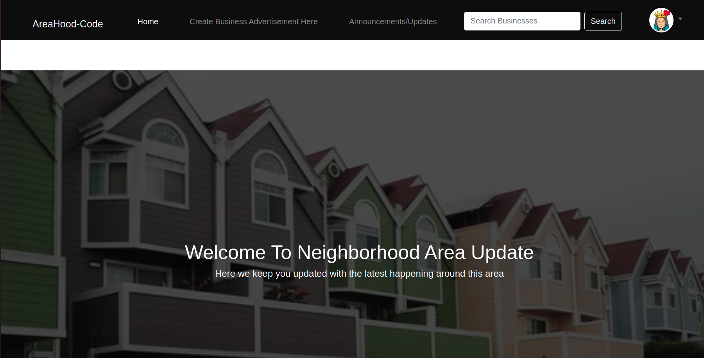

## Neighborhood AreaCode Project
This neighborhood project enbales the residents in the neighborhood to be updated with the latest news and updates in their neighborhood. Residents can also access various important services easily.

## Author 
* Shalin Rono

## screenshot-images
   

##### Built With

- Python3.8 

- Django3.2.8

- Bootstrap4

- CSS

### Prerequisites
* Create and activate Virtual env then install pip
* To install django -pip install django LTS
* Have basic git knowledge

### Installation

1. Clone the repository
   
   git clone https://github.com/sha-lin/neighbourhood

2. Install the latest django version and other requirements in my requirements.txt file

## Usage

Residents can get various services easily and also post any updates they'd wish to inform their fellow residents. 

## Contributing
Any contributions you make are **greatly appreciated**.

If you have a suggestion that would make this better, please fork the repo and create a pull request. 

1. Fork the Project
2. Create your Feature Branch (`git checkout -b feature/AmazingFeature`)
3. Commit your Changes (`git commit -m 'Add some AmazingFeature'`)
4. Push to the Branch (`git push origin feature/AmazingFeature`)
5. Open a Pull Request

## Contact Information
E_MAIL -ronoshalin@gmail.com

Project Link: [https://github.com/sha-lin/neighbourhood](https://github.com/sha-lin/neighbourhood)
## License
https://github.com/sha-lin/neighbourhood/blob/master/LICENSE
# **Copyright**
Copyright (c) {2021} **SHALIN RONO**